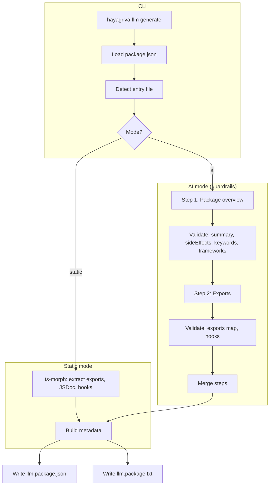

# hayagriva-llm

[](https://www.npmjs.com/package/hayagriva-llm)
[](https://www.npmjs.com/package/hayagriva-llm)
[](https://www.npmjs.com/package/hayagriva-llm)
[](https://nodejs.org)
[](https://opensource.org/licenses/MIT)
[](https://github.com/prakhardubey2002/hayagriva-llm)

**Structured LLM metadata for Node.js packages** — the first standard for machine-readable package context in the npm ecosystem. Generates `llm.package.json` and `llm.package.txt` for indexing, search, and IDE tooling (e.g. Cursor, Antigravity).

📖 **Documentation:** Full docs are built with [Docusaurus](https://docusaurus.io/) and deployed to **GitHub Pages**. See [Deploying the docs](#deploying-the-docs) for setup. After deployment, the site is available at:

**https://prakhardubey2002.github.io/hayagriva-llm/**

---

## Install

```bash
npm install -g hayagriva-llm
# or
npx hayagriva-llm generate
```

**Requirements:** Node.js 18+

---

## Usage

From your package root:

```bash
hayagriva-llm generate [options]
```

| Option            | Description                                   | Default                                     |
| ----------------- | --------------------------------------------- | ------------------------------------------- |
| `--mode <type>`   | `static` (ts-morph) or `ai` (OpenRouter)      | `static`                                    |
| `--api-key <key>` | OpenRouter API key (required for `--mode ai`) | `OPEN_ROUTER_API_KEY` env                   |
| `--model <name>`  | OpenRouter model (AI mode)                    | `openai/gpt-4o-mini` or `OPEN_ROUTER_MODEL` |
| `--include-src`   | Include full entry source in AI prompt        | off                                         |
| `--verbose`       | Debug logging                                 | off                                         |

**Examples:**

```bash
# Static mode (no API key): extract exports from TypeScript/JavaScript entry
hayagriva-llm generate

# AI mode: richer metadata (summary, side effects, keywords) via OpenRouter
hayagriva-llm generate --mode ai

# AI with custom model and full source context
hayagriva-llm generate --mode ai --model openai/gpt-4o --include-src --verbose
```

---

## Environment

| Variable              | Description                                           |
| --------------------- | ----------------------------------------------------- |
| `OPEN_ROUTER_API_KEY` | OpenRouter API key (required for AI mode)             |
| `OPEN_ROUTER_MODEL`   | Default model for AI mode (e.g. `openai/gpt-4o-mini`) |

Copy `.env.example` to `.env` and set `OPEN_ROUTER_API_KEY` (and optionally `OPEN_ROUTER_MODEL`) for AI mode. Legacy names `OPENROUTER_API_KEY` and `HAYAGRIVA_LLM_MODEL` are still supported.

---

## Output

- **`llm.package.json`** — Structured metadata: name, version, description, `exports`, `hooks`, `frameworks`, optional `summary`, `sideEffects`, `keywords`; IDE- and search-friendly.
- **`llm.package.txt`** — LLM-optimized plain-text summary for context windows and retrieval.

---

## Flow (high level)



Detailed flow (entry detection, validation, and file layout) is in the [documentation site](#docs) (see [Flow & architecture](website/docs/flow.md) in the repo).

---

## Using hayagriva-llm in your package

Add it as a **devDependency** so your package always ships up-to-date LLM metadata.

### 1. Install

```bash
npm install -D hayagriva-llm
```

### 2. Generate metadata (manual or script)

From your package root:

```bash
# Static mode — no API key; uses ts-morph on your entry file
npx hayagriva-llm generate

# AI mode — set OPEN_ROUTER_API_KEY in .env first
npx hayagriva-llm generate --mode ai
```

This writes `llm.package.json` and `llm.package.txt` in the current directory. Commit them so consumers and tooling (e.g. Cursor, Antigravity) can use them.

### 3. Add an npm script (optional)

In your `package.json`:

```json
{
  "scripts": {
    "llm:generate": "hayagriva-llm generate",
    "prepublishOnly": "npm run llm:generate"
  }
}
```

- **`llm:generate`** — run whenever you want to refresh metadata.
- **`prepublishOnly`** — regenerates metadata before `npm publish` so the published package always has current exports.

For AI mode in scripts, ensure `OPEN_ROUTER_API_KEY` (and optionally `OPEN_ROUTER_MODEL`) are set in your environment or in a `.env` file. The CLI loads `.env` via `dotenv` automatically.

---

## Automating with Husky

Use [Husky](https://typicode.github.io/husky/) to run `hayagriva-llm generate` automatically (e.g. before commit) so `llm.package.json` and `llm.package.txt` stay in sync without manual runs.

### 1. Install Husky

```bash
npm install -D husky
npx husky init
```

This creates `.husky/` and a default `pre-commit` hook.

### 2. Hook: regenerate metadata before commit

Edit `.husky/pre-commit` so it runs the generator and re-stages the output:

```bash
# Regenerate LLM metadata (uses .env for OPEN_ROUTER_API_KEY if you use --mode ai)
npx hayagriva-llm generate

# Re-stage generated files so they are included in the commit
git add llm.package.json llm.package.txt
```

- **Static mode:** No env needed; the hook just runs `hayagriva-llm generate` (default mode is `static`).
- **AI mode:** Set `OPEN_ROUTER_API_KEY` (and optionally `OPEN_ROUTER_MODEL`) in `.env` in the repo root. The CLI loads `.env` automatically. Example hook for AI mode:

  ```bash
  npx hayagriva-llm generate --mode ai
  git add llm.package.json llm.package.txt
  ```

### 3. Combine with lint / test (optional)

Run lint and tests in the same hook, then generate metadata:

```bash
# Example: lint and test first, then regenerate metadata
npm run lint
npm test
npx hayagriva-llm generate
git add llm.package.json llm.package.txt
```

Adjust `lint` / `test` to match your `package.json` scripts.

### 4. Different hooks to fit your workflow

| Hook         | When it runs             | Use case                                      |
| ------------ | ------------------------ | --------------------------------------------- |
| `pre-commit` | Before each commit       | Always keep metadata in sync with latest code |
| `pre-push`   | Before each push         | Lighter; regenerate only before pushing       |
| `post-merge` | After `git pull` / merge | Refresh metadata after pulling changes        |

Example **pre-push** (`.husky/pre-push`):

```bash
npm test
npx hayagriva-llm generate
git add llm.package.json llm.package.txt
```

---

## Automating with GitHub Actions

Run `hayagriva-llm generate` in CI to validate that metadata is present and up to date, or to publish it as an artifact.

### Example: check metadata on push/PR

Create `.github/workflows/llm-metadata.yml`:

```yaml
name: LLM metadata

on:
  push:
    branches: [main]
  pull_request:
    branches: [main]

jobs:
  generate-and-check:
    runs-on: ubuntu-latest
    steps:
      - uses: actions/checkout@v4

      - name: Setup Node
        uses: actions/setup-node@v4
        with:
          node-version: '20'
          cache: 'npm'

      - name: Install dependencies
        run: npm ci

      - name: Install hayagriva-llm
        run: npm install -D hayagriva-llm

      - name: Generate LLM metadata (static)
        run: npx hayagriva-llm generate

      - name: Check metadata is committed
        run: |
          git diff --exit-code llm.package.json llm.package.txt || \
            (echo "::error::llm.package.json or llm.package.txt are out of date. Run: npx hayagriva-llm generate" && exit 1)
```

This fails the workflow if someone forgets to run the generator after changing exports.

### Example: generate with AI in CI (optional)

If you want AI mode in CI, add your OpenRouter key as a repo secret (e.g. `OPEN_ROUTER_API_KEY`) and run:

```yaml
- name: Generate LLM metadata (AI)
  env:
    OPEN_ROUTER_API_KEY: ${{ secrets.OPEN_ROUTER_API_KEY }}
  run: npx hayagriva-llm generate --mode ai
```

Then use the same “check metadata is committed” step, or upload `llm.package.json` / `llm.package.txt` as artifacts.

---

## Docs

The full documentation is built with **Docusaurus**. Source lives in `website/docs/`; the build output is written to the repo **`docs/`** folder so GitHub Pages can deploy from it (GitHub allows only the **docs** folder or the root as the deployment source).

| Page                                        | Description                                     |
| ------------------------------------------- | ----------------------------------------------- |
| [Introduction](website/docs/intro.md)       | Get started, install, options                   |
| [Flow & architecture](website/docs/flow.md) | End-to-end pipeline and Mermaid diagrams        |
| [Schema](website/docs/schema.md)            | `llm.package.json` and `llm.package.txt` format |
| [AI mode](website/docs/ai-mode.md)          | Multi-step AI flow and guardrails               |

**Run the docs locally:** `npm run docs:install` then `npm run docs:start` (from repo root).

### Deploying the docs (GitHub Pages from `/docs`)

1. **Build to `docs/`:** Run `npm run docs:build` from repo root. Docusaurus writes the static site into **`docs/`**.
2. **Enable GitHub Pages:** In the repo **Settings → Pages → Build and deployment → Source**, choose **Deploy from a branch**. Select branch **main** and folder **/docs**. Save.
3. **Commit and push:** Commit the built `docs/` folder and push to `main`. The workflow [Build docs (for GitHub Pages /docs)](.github/workflows/deploy-docs.yml) can build Docusaurus to `docs/` and commit it on push to `main`, or you can run `npm run docs:build` locally and commit `docs/` yourself.

The site will be at **https://prakhardubey2002.github.io/hayagriva-llm/** (see `website/docusaurus.config.js`).

---

## Pre-commit (Husky)

This repo uses [Husky](https://typicode.github.io/husky/) for pre-commit hooks. On commit, the hook runs:

1. **Lint** — `npm run lint` (ESLint on `src/` and `test/`)
2. **Test** — `npm test` (Vitest)
3. **Build** — `npm run build`
4. **Size limit** — `npx size-limit` (checks `dist/cli.cjs` and `dist/cli.mjs` stay under 50 kB)

Install once: `npm install`. The `prepare` script runs `husky` so the `.husky/pre-commit` hook is installed.

---

## Publishing to npm

1. **Login** — `npm login` (create an account at [npmjs.com](https://www.npmjs.com/signup) if needed).
2. **Publish** — From the package root run:
   ```bash
   npm publish
   ```
   `prepublishOnly` will run lint, tests, and build before publishing. Only the `dist/` folder is included (`files` in package.json); README and LICENSE are included by npm by default.

Repository: [github.com/prakhardubey2002/hayagriva-llm](https://github.com/prakhardubey2002/hayagriva-llm) · npm: [hayagriva-llm](https://www.npmjs.com/package/hayagriva-llm). For a scoped package (e.g. `@your-org/hayagriva-llm`), set `"name": "@your-org/hayagriva-llm"` and run `npm publish --access public`.

---

## License

[MIT](LICENSE)
