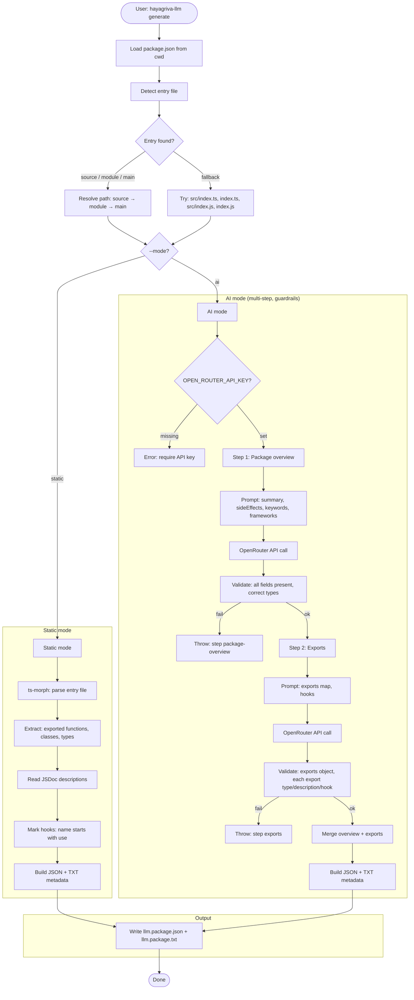
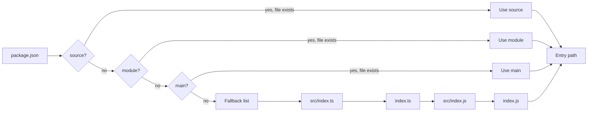
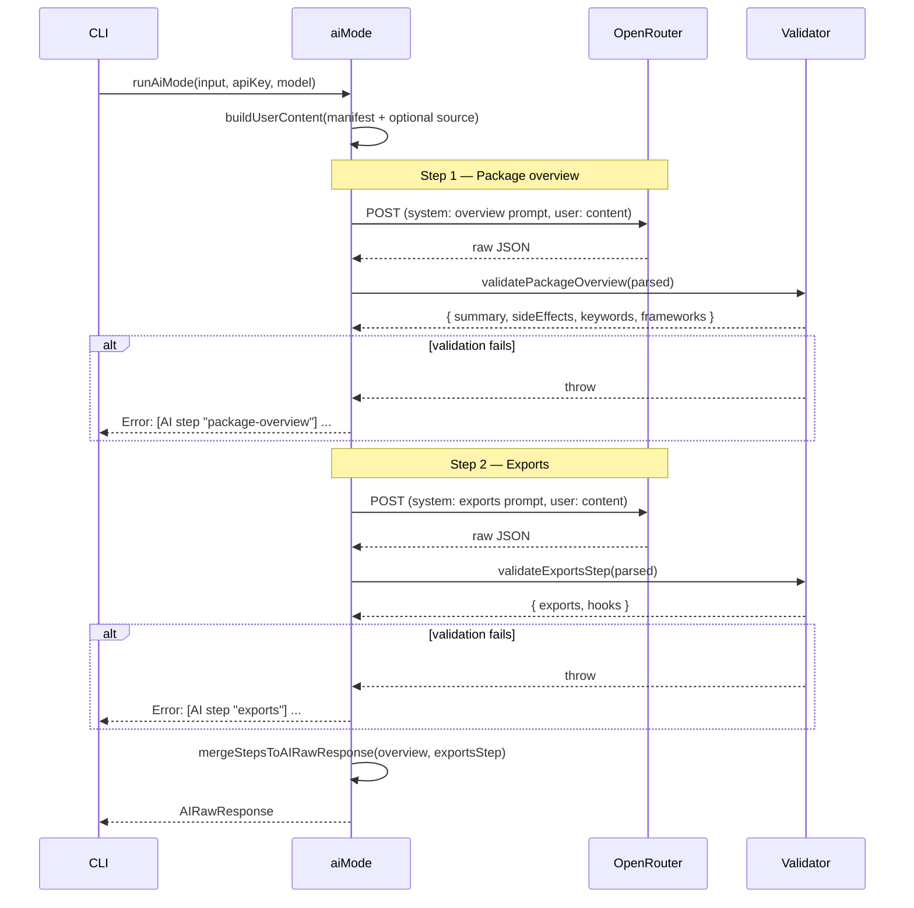
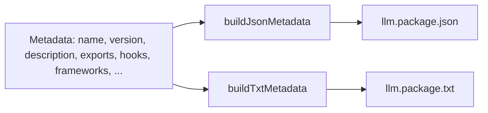

# Flow & architecture

End-to-end flow of the package from CLI invocation to generated files.

---

## Full pipeline

---

## Entry file detection

Priority: **source** → **module** → **main** → first existing of `src/index.ts`, `index.ts`, `src/index.js`, `index.js`.

---

## AI mode: two-step guardrails

AI mode uses **two separate API calls** so each step has a narrow, strict schema.

**Step 1** enforces: `summary` (string), `sideEffects`, `keywords`, `frameworks` (string arrays).  
**Step 2** enforces: `exports` (object), each value has `type`, `description`, `hook`; optional `params`, `returns`, `sideEffect`, `example`. `hooks` must be a string array.

---

## Output generation (both modes)

Same merge step for static and AI: `buildJsonMetadata` and `buildTxtMetadata` consume the unified metadata shape and write the two files under the current working directory.
